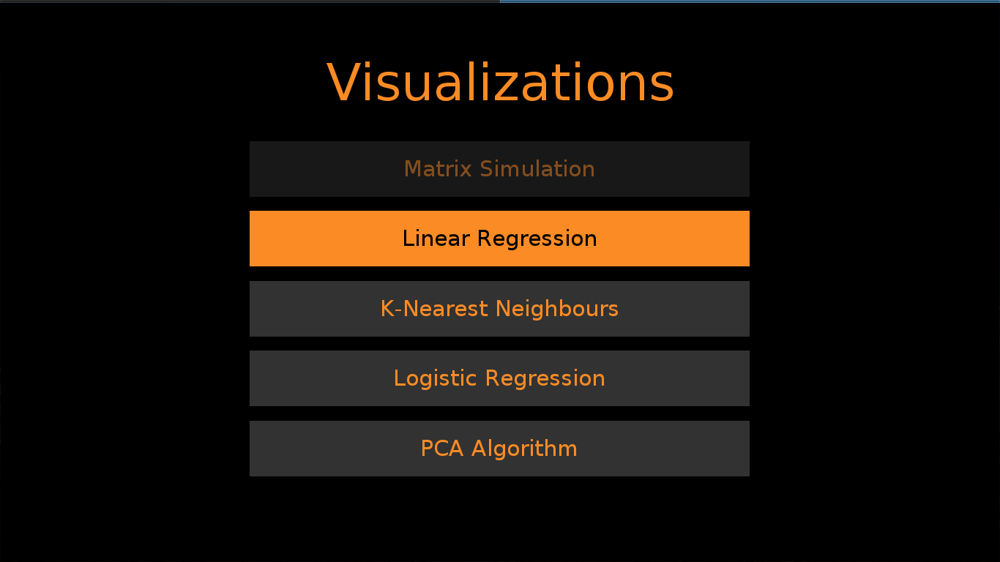
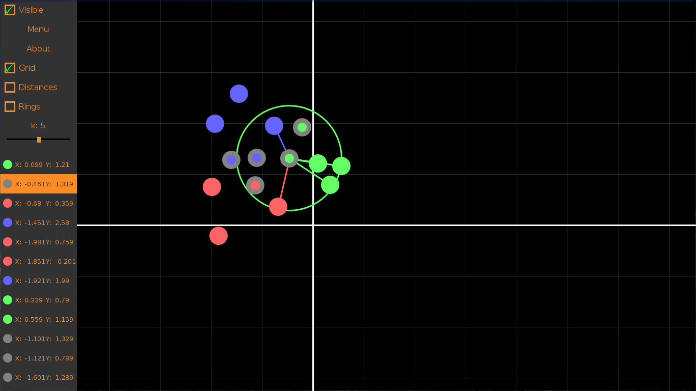
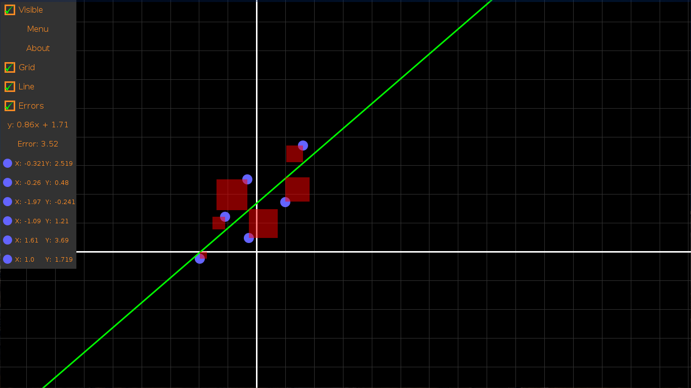
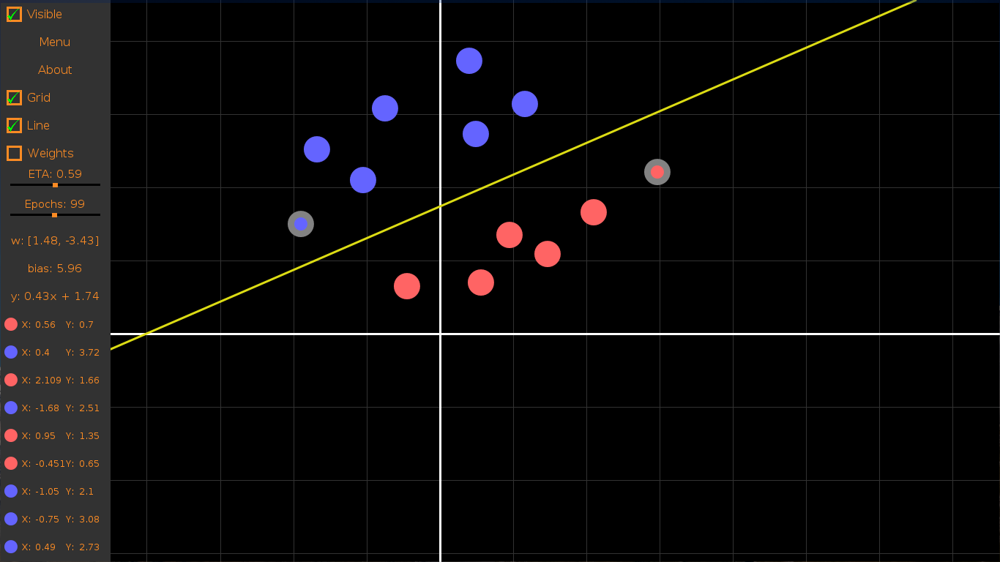
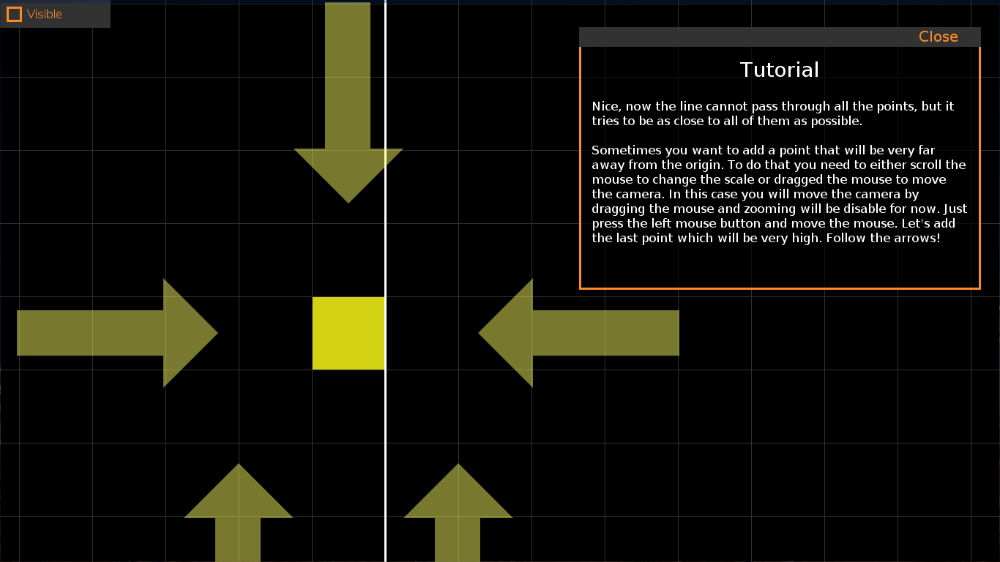

# MathVisualizer
Simple app written in java to visualize some math problems. 

## Available simulations:
+ Matrix
+ Linear regression
+ K nearest neighbours
+ Logistic regression
+ PCA Algorithm

## Coming soon:
+ ID-Tree
+ Algorithm simulations on graphs and trees
+ functions 

## Screenshots

